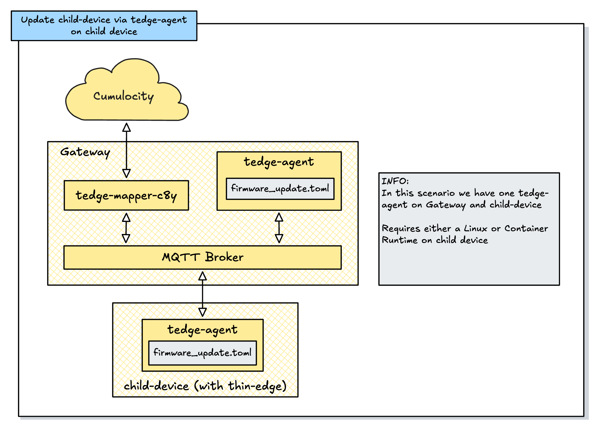

# Overview

In this setting we have:
- A Gateway with thin-edge.io (mapper, mqtt broker and tedge-agent) running
- A connected child-device with a tedge-agent instance running locally

# Description

Please consult [https://thin-edge.github.io/thin-edge.io/](https://thin-edge.github.io/thin-edge.io/) here. 