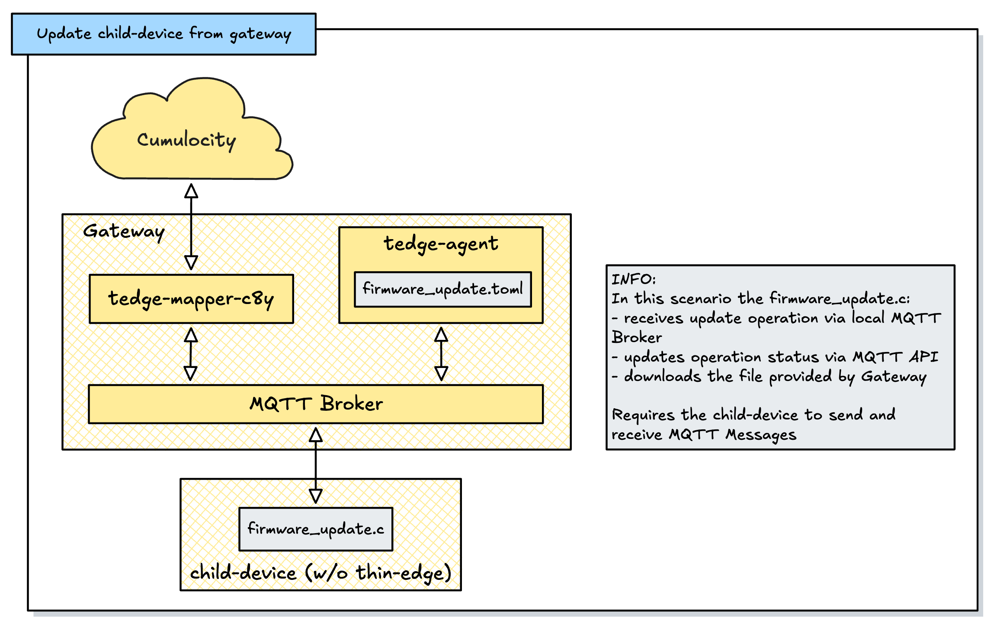

# Overview

In this option we have:
- a Gateway having thin-edge.io (mapper, mqtt broker and tedge-agent) running
- a child-device without thin-edge.io components being installed

The connected child-device will use the MQTT Broker running on the Gateway to receive firmware update instruction and to report about the firmware update progress. The firmware image will be downloaded from the Gateway. 





# Description

1. Register child device:

```sh
tedge mqtt pub -r 'te/device/child03//' '{
  "@type": "child-device",
  "name": "Child 03",
  "type": "RaspberryPi4"
}'
```

2. Announce to be able to do firmware updates:

```sh
tedge mqtt pub -r 'te/device/child03///cmd/firmware_update' '{}'
```

3. Set current firmware version

```sh
tedge mqtt pub -r 'te/device/child03///twin/firmware' '{"name": "my firmware 2", "version":"1.0.0"}'
```

4. Subscribe for firmware updates:

```sh
tedge mqtt sub 'te/device/child03///cmd/firmware_update/+'
```

5. Received message:

  ```text
  Topic = te/device/child03///cmd/firmware_update/c8y-mapper-210293 
  Message = {"status":"init","tedgeUrl":"https://tedge:8001/c8y/inventory/binaries/77206248","remoteUrl":"https://t40073098.cumulocity.com/inventory/binaries/77206248","name":"my firmware 2","version":"1.0.1"}
  ```

6. Set Operation to executing status:

```sh
tedge mqtt pub -r 'te/device/child03///cmd/firmware_update/c8y-mapper-210293' '{"status":"executing","tedgeUrl":"https://tedge:8001/c8y/inventory/binaries/77206248","remoteUrl":"https://t40073098.cumulocity.com/inventory/binaries/77206248","name":"my firmware 2","version":"1.0.1"}'
```

7. Now download file from `tedgeUrl` property...

> The host and port of your tedgeUrl is determined by the thin-edge configurations c8y.proxy.client.host and c8y.proxy.client.port. Adapt them on the Gateway if needed.

8. Now do firmware update ...

9. If firmware update successful:

```sh
# Report the new firmware version to Cloud
tedge mqtt pub -r 'te/device/child03///twin/firmware' '{"name": "my firmware 2", "version":"1.0.1"}'

# Update operation to successful
tedge mqtt pub -r 'te/device/child03///cmd/firmware_update/c8y-mapper-210293' '{"status":"successful","tedgeUrl":"https://tedge:8001/c8y/inventory/binaries/77206248","remoteUrl":"https://t40073098.cumulocity.com/inventory/binaries/77206248","name":"my firmware 2","version":"1.0.1"}'
```

10. If firmware update not successful:

```sh
# Update operation to failed, set a failure reason
tedge mqtt pub -r 'te/device/child03///cmd/firmware_update/c8y-mapper-210293' '{"status":"failed", "reason": "your failure reason here", "tedgeUrl":"https://tedge:8001/c8y/inventory/binaries/77206248","remoteUrl":"https://t40073098.cumulocity.com/inventory/binaries/77206248","name":"my firmware 2","version":"1.0.1"}'
```

# Documentation

* MQTT API: [https://thin-edge.github.io/thin-edge.io/references/mqtt-api/](https://thin-edge.github.io/thin-edge.io/references/mqtt-api/)

* Device Management API: [https://thin-edge.github.io/thin-edge.io/references/agent/device-management-api/](https://thin-edge.github.io/thin-edge.io/references/agent/device-management-api/)

* Sample implementation: [https://github.com/thin-edge/freertos-esp32-client](https://github.com/thin-edge/freertos-esp32-client)