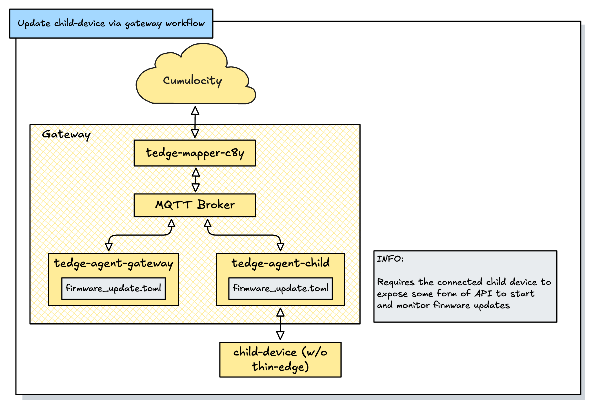

# Overview

In this option we have:
- a Gateway having thin-edge.io (mapper, mqtt broker and tedge-agent) running
- an additional tedge-agent instance for a connected child-device on the Gateway. This instance will take care of doing Firmware Updates on the child-device via firmware workflows
- nothing from thin-edge.io running on the connected child-device



# Description

> Below description describe how to run a dedicated tedge-agent instance for a child-device as systemd service. You can of course also run the instance with a different service manager or containerized. 

1. Create systemd service template definition

```sh
cat <<EOT > /lib/systemd/system/tedge-agent@.service 
[Unit]
Description=tedge-agent (device/%i//) is a thin-edge.io component to support operations.
After=syslog.target network.target mosquitto.service

[Service]
User=tedge
EnvironmentFile=-/etc/agents/%i/env

Environment=TEDGE_RUN_LOCK_FILES=false
Environment=TEDGE_CONFIG_DIR=/etc/agents/%i
Environment=TEDGE_AGENT_STATE_PATH=/data/tedge-%i
RuntimeDirectory=tedge-agent-%i
ExecStartPre=+-/usr/bin/tedge init
ExecStart=/usr/bin/tedge-agent --mqtt-device-topic-id "device/%i//"
Restart=on-failure
RestartPreventExitStatus=255
RestartSec=5

[Install]
WantedBy=multi-user.target
EOT
```

2. Create a new service from the systemd service template

```sh
systemctl enable --now tedge-agent@proxy-child01.service
```

Where the string after the `@` sign is used in the topic prefix, e.g. `device/<name>//`

3. Check that the service is running

```sh
systemctl status tedge-agent@proxy-child01.service
```

4. Add any agent specific files under the relevant sub folder (which is created when the service is started)
  
```sh
ls -l /etc/agents/proxy-child01
```

5. Check in Cumulocity that the new child device (represented by the new tedge-agent service) is visible

6. You can then add tedge-agent workflows under the following folder

```sh
ls -l /etc/agents/proxy-child01/operations/
```

# Sample Workflow

Here is a (dummy-) workflow that can be used in step 6. Please consult the documentation for [user defined workflows](https://thin-edge.github.io/thin-edge.io/references/agent/operation-workflow/) and the examples linked in below "Documentation" section to explore options for such workflows. 

```toml
operation = "firmware_update"

[init]
action = "proceed"
on_success = "scheduled"

[scheduled]
script = "sleep 1"
on_success = "executing"

[executing]
script = "sleep 1"
on_success = "restart"

[restart]
operation = "restart"
on_exec = "waiting_for_restart"

[waiting_for_restart]
action = "await-operation-completion"
on_success = "verify"
on_error = { status = "failed", reason = "fail to restart"}

[verify]
script = "sleep 1"
on_success = "commit"
on_error = "rollback"

[rollback]
script = "sleep 1"
on_success = "rollback_restart"
on_error = "rollback_restart"

[rollback_restart]
operation = "restart"
on_exec = "waiting_for_rollback_restart"

[waiting_for_rollback_restart]
action = "await-operation-completion"
on_success = { status = "failed", reason = "firmware update failed but rollback was successful"}
on_error = { status = "failed", reason = "fail to restart"}

[commit]
script = "sleep 1"
on_success = "publish"
on_error = "failed"

[publish]
script = "tedge mqtt pub --retain --qos 1 ${.topic.root_prefix}/${.topic.target}/twin/firmware '{\"name\":\"${.payload.name}\",\"version\":\"${.payload.version}\",\"url\":\"${.payload.url}\"}'"
on_success = "successful"
on_error = "failed"

[successful]
action = "cleanup"

[failed]
action = "cleanup"
```

# Documentation

* User defined workflows: [https://thin-edge.github.io/thin-edge.io/references/agent/operation-workflow/](https://thin-edge.github.io/thin-edge.io/references/agent/operation-workflow/)

* Sample workflow for simulated FW update: [https://github.com/thin-edge/tedge-demo-container/blob/main/images/common/utils/workflows/firmware_update.toml](https://github.com/thin-edge/tedge-demo-container/blob/main/images/common/utils/workflows/firmware_update.toml)

* Sample workflow for FW update via RAUC: [https://github.com/thin-edge/meta-tedge/tree/kirkstone/meta-tedge-rauc/recipes-tedge/tedge-firmware-rauc/tedge-firmware-rauc](https://github.com/thin-edge/meta-tedge/tree/kirkstone/meta-tedge-rauc/recipes-tedge/tedge-firmware-rauc/tedge-firmware-rauc)

* Sample workflow for FW Update via Rugix: [https://github.com/thin-edge/meta-tedge/blob/kirkstone/meta-tedge-rugix/recipes-tedge/tedge-firmware-rugix/tedge-firmware-rugix](https://github.com/thin-edge/meta-tedge/blob/kirkstone/meta-tedge-rugix/recipes-tedge/tedge-firmware-rugix/tedge-firmware-rugix)

* Sample workflow for FW Update via Mender: [https://github.com/thin-edge/meta-tedge/blob/kirkstone/meta-tedge-mender/recipes-tedge/tedge-firmware/tedge-firmware](https://github.com/thin-edge/meta-tedge/blob/kirkstone/meta-tedge-mender/recipes-tedge/tedge-firmware/tedge-firmware)